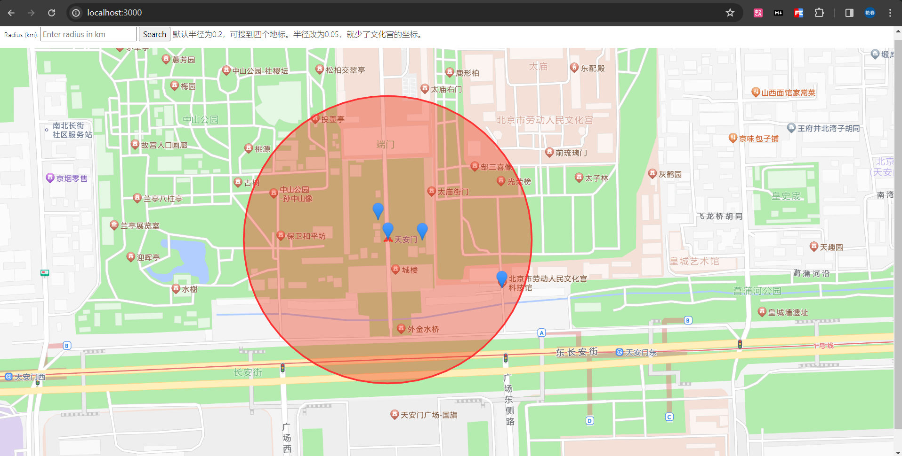

# 附近的充电宝

本项目是一个基于位置的搜索服务，用于查找和显示附近的充电宝位置。使用NestJS框架与Redis数据库实现。

## 如何运行

1. 克隆仓库到本地：

   ```
   git clone https://github.com/Cicici-Shi/nearby-search.git
   ```

2. 安装依赖：

   ```
   npm install
   ```

3. 启动开发服务器：
   ```
   npm run start:dev
   ```

启动后，你可以在浏览器中访问 [http://localhost:3000](http://localhost:3000) 来查看项目。

## 设置Redis

确保你的Redis服务器正在运行，并且可以在默认端口（6379）上进行连接。你可以使用以下命令来启动Redis服务器（如果使用Docker）：

```
docker run --name some-redis -d redis
```

## 添加地标

在Redis服务运行后，通过以下URL在系统中添加地标位置：

- 天安门:  
  `/addPos?name=天安门&longitude=116.397444&latitude=39.909183`

- 文化宫科技馆:  
  `/addPos?name=文化宫科技馆&longitude=116.3993&latitude=39.908578`

- 售票处:  
  `/addPos?name=售票处&longitude=116.397283&latitude=39.90943`

- 故宫彩扩部:  
  `/addPos?name=故宫彩扩部&longitude=116.398002&latitude=39.909175`

这样，你可以添加4个地标到系统中。

## 查看结果

添加地标后，你可以在地图上看到距离中心点一定半径内的地标。


